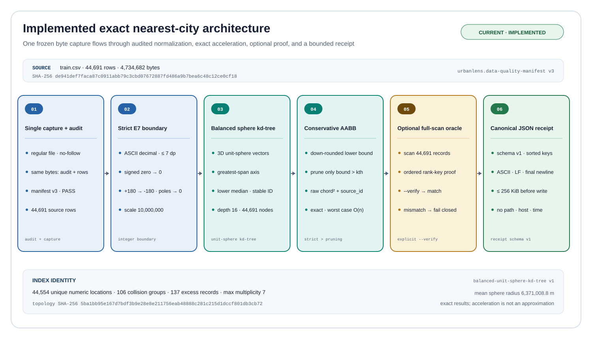
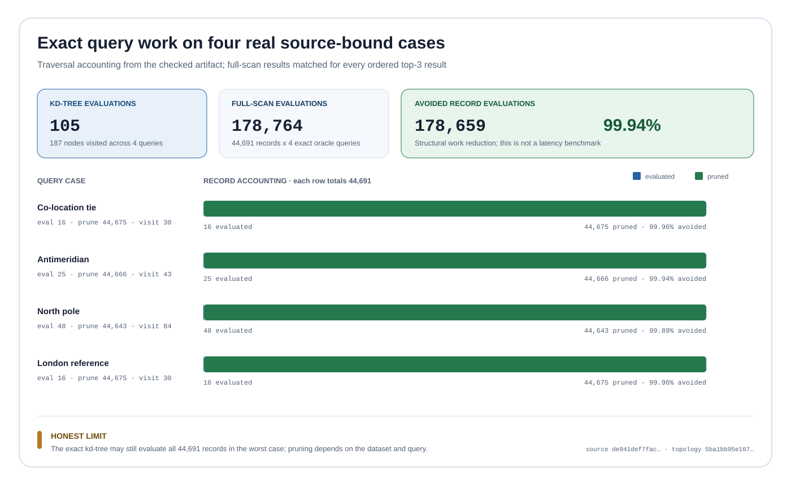
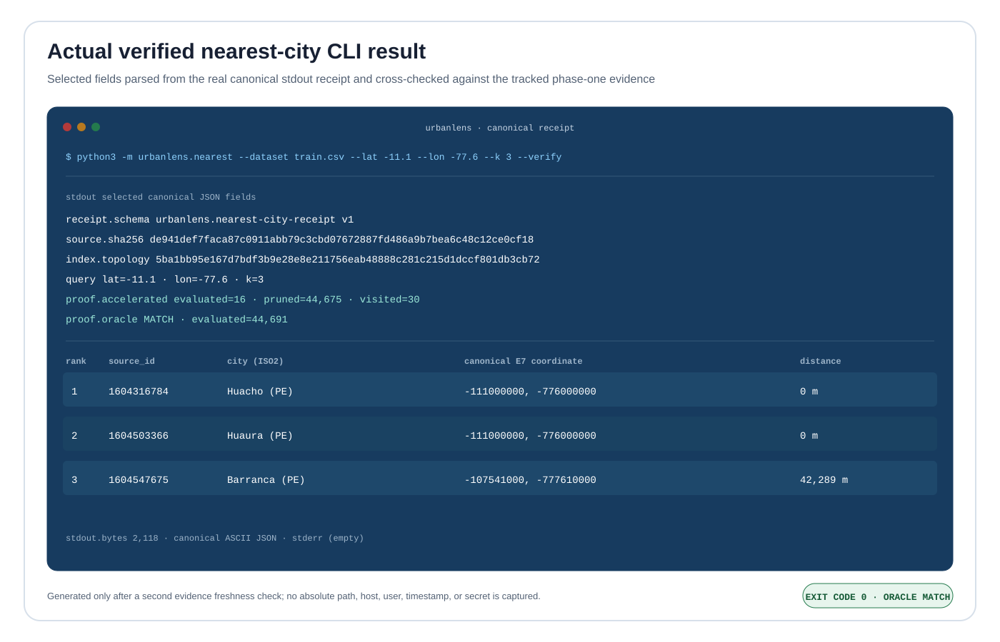
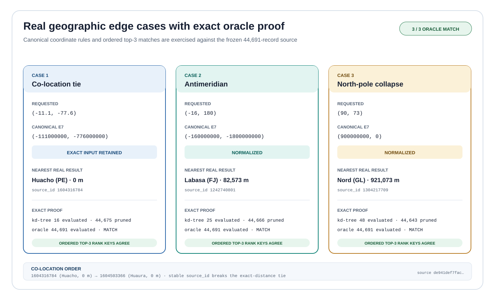
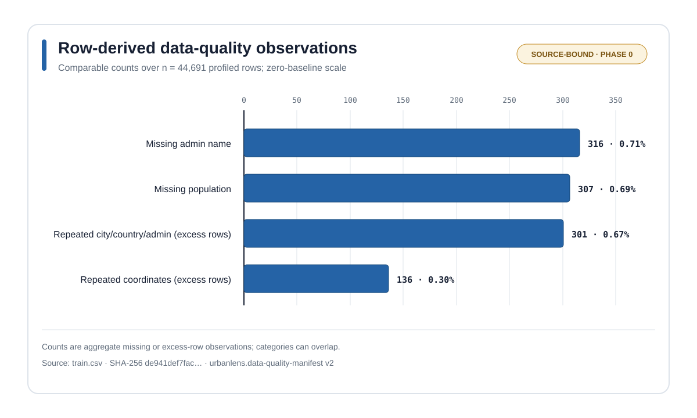
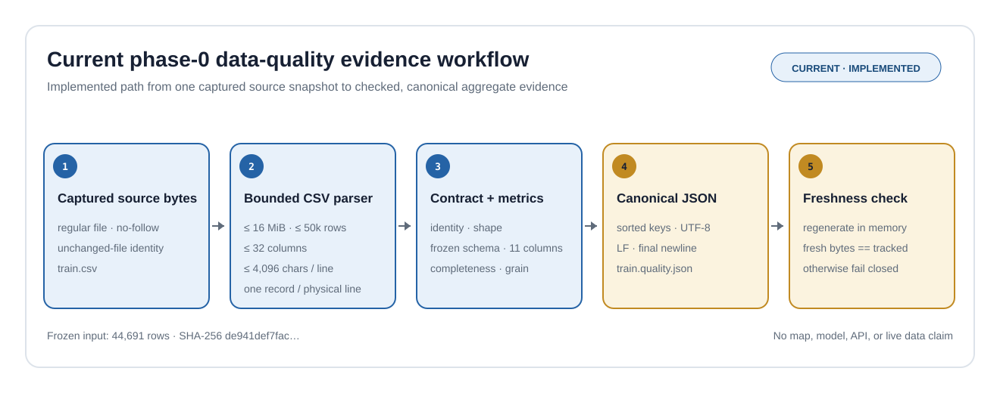
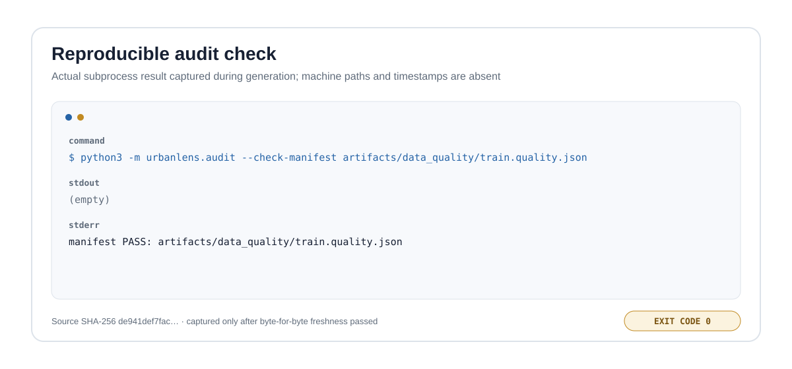

# UrbanLens

UrbanLens is an auditable exact nearest-city engine over a frozen historical
world-cities snapshot. It turns 44,691 source records into a deterministic
unit-sphere k-d tree, proves every checked result against a full-scan oracle,
and emits bounded canonical JSON receipts.

This repository is deliberately more than a nearest-neighbour demo. The source
is captured once, audited before indexing, normalized with exact E7 integer
coordinates, searched with conservative floating-point bounds, and tied to
reproducible evidence and real CLI captures.



## What is implemented

| Capability | Verified contract |
| --- | --- |
| Frozen input | 44,691 rows, 11 columns, 4,734,682 bytes |
| Source identity | SHA-256 `de941def7faca87c0911abb79c3cbd07672887fd486a9b7bea6c48c12ce0cf18` |
| Numeric locations | 44,554 canonical E7 coordinate pairs |
| Co-location structure | 106 groups, 137 records beyond the first, maximum multiplicity 7 |
| Exact index | Deterministic balanced 3D unit-sphere k-d tree, depth 16 |
| Ranking | Binary64 squared chord distance, then stable source ID |
| Verification | Optional full scan using the same public rank contract |
| Query bound | One query per process, `1 <= k <= 100` |
| Receipt bound | Canonical ASCII JSON, at most 256 KiB |
| Runtime dependencies | None; Python 3.11 or 3.12 |

The checked four-query evidence workload evaluates 105 candidate records with
the tree and 178,764 with the oracle, avoiding 178,659 evaluations (99.94%).
That is structural work accounting for this fixed snapshot and workload, not a
wall-clock speed-up claim. The exact algorithm still has an honest `O(n)`
worst case.



## Run it

Create an isolated environment and install the package with its development
tools:

```bash
python3 -m venv .venv
.venv/bin/python -m pip install -e '.[dev]'
```

Verify the tracked source manifest before building an index:

```bash
.venv/bin/urbanlens-audit \
  --check-manifest artifacts/data_quality/train.quality.json
```

Run a real query at a source location shared by two distinct records:

```bash
.venv/bin/urbanlens-nearest \
  --dataset train.csv \
  --lat -11.1 \
  --lon -77.6 \
  --k 3 \
  --verify
```

The command returns a complete canonical receipt. These selected fields are
from the checked result:

```json
{
  "proof": {
    "accelerated": {
      "evaluated": 16,
      "pruned": 44675,
      "visited": 30
    },
    "oracle": {
      "evaluations": 44691,
      "status": "match"
    }
  },
  "results": [
    {
      "city_ascii": "Huacho",
      "distance_m": 0,
      "rank": 1,
      "source_id": "1604316784"
    },
    {
      "city_ascii": "Huaura",
      "distance_m": 0,
      "rank": 2,
      "source_id": "1604503366"
    }
  ]
}
```

The full output also binds the source digest, audit schema, index algorithm,
topology digest, normalized query, all requested results, and traversal
accounting.



## Why the result is exact

### One source capture

`train.csv` is opened through the bounded no-follow audit path and retained as
one immutable in-memory capture. Audit checks, row projection, and index
construction consume that same object. There is no audit-then-reopen gap.

The build fails closed unless the capture matches the pinned SHA-256, byte
size, row count, ordered schema, unique source IDs, and all 16 aggregate audit
checks.

### Strict coordinate boundary

Coordinates must match this ASCII grammar:

```text
-?(?:0|[1-9][0-9]*)(?:\.[0-9]{1,7})?
```

The parser rejects whitespace, exponent notation, Unicode digits, separators,
leading `+`, non-finite spellings, ambiguous leading zeroes, excessive
precision, and out-of-range values before publishing a point.

Accepted coordinates are stored as signed E7 integers. Signed zero becomes
zero, longitude `+180` becomes `-180`, and longitude collapses to zero at
either exact pole. Equality therefore follows geographic canonicalization
rather than CSV token spelling.

### Deterministic spherical index

Every canonical point is projected to a 3D unit vector. Construction begins
from source-ID order; each subtree chooses the axis with greatest span,
breaks axis ties as `x`, `y`, then `z`, and selects the lower median. Duplicate
coordinates remain separate records.

The checked topology digest is:

```text
5ba1bb95e167d7bdf3b9e28e8e211756eab48888c281c215d1dccf801db3cb72
```

The same supported runtime, source bytes, and algorithm version produce the
same tree and query order regardless of input order or `PYTHONHASHSEED`.

### Conservative pruning

Each subtree stores a 3D axis-aligned bounding box. The query engine rounds
positive lower-bound components downward and the current worst accepted
distance upward with `math.nextafter`.

A subtree is pruned only when:

```text
conservative_lower_bound > upward_rounded_worst_distance
```

The comparison is strict. Equal-distance subtrees are still visited because a
smaller source ID can change the declared order.

### Independent traversal check

`--verify` runs a full scan over all 44,691 records and requires the ordered
rank keys to match the accelerated result exactly. The oracle is an
independent traversal, not a second physical distance model: it catches tree,
bounding, pruning, and ordering errors without pretending to establish
ellipsoidal ground truth.

The full numerical, ranking, resource, and disclosure contract is documented
in [Exact spatial-search contract](docs/spatial-search-contract.md).

## Real edge-case evidence

Four fixed public queries are regenerated from the source capture and checked
against the oracle:

| Case | Canonical query | Tree evaluated | Oracle evaluated | First result |
| --- | --- | ---: | ---: | --- |
| Co-location | `(-11.1, -77.6)` | 16 | 44,691 | Huacho, 0 m; Huaura is also 0 m |
| Antimeridian | `(-16, +180)` → `(-16, -180)` | 25 | 44,691 | Labasa, 82,573 m |
| North pole | `(90, 73)` → `(90, 0)` | 48 | 44,691 | Nord, 921,073 m |
| London reference | `(51.5074, -0.1278)` | 16 | 44,691 | London, 30 m |

The chart and table show evaluated records, not elapsed time. Labels and
coordinates come from the separately licensed public dataset; no private or
synthetic user data is involved.



## Reproduce the evidence

The phase-1 artifact is canonical JSON generated by executable code:

```bash
python3 -m urbanlens.spatial_evidence --check
python3 -m urbanlens.spatial_visuals --check
```

To intentionally regenerate it after a reviewed code or source change:

```bash
python3 -m urbanlens.spatial_evidence --write
python3 -m urbanlens.spatial_visuals --write
python3 -m urbanlens.spatial_evidence --check
python3 -m urbanlens.spatial_visuals --check
```

The evidence artifact contains no timestamp, duration, absolute path,
hostname, username, process ID, or raw binary64 rank key. It records integer
distances, exact traversal counts, source and topology digests, and an integer
fraction for work reduction. Visual generation reruns the fixed CLI capture
and compares its parsed receipt with the same checked evidence.

Tracked evidence:

- [phase1-evidence.json](artifacts/spatial/phase1-evidence.json)
- [data-quality manifest](artifacts/data_quality/train.quality.json)
- [phase-1 spatial-search contract](docs/spatial-search-contract.md)
- [phase-0 visual evidence contract](docs/chart-contract.md)
- [data-quality manifest v3 contract](docs/data-quality-manifest-v3.md)

## Data-quality foundation

The exact search layer sits on a source-bound audit rather than assuming that
a readable CSV is trustworthy.

| Check | Result | Why it matters |
| --- | ---: | --- |
| Duplicate or blank IDs | 0 | `id` is a viable row key for this snapshot |
| Invalid latitude / longitude | 0 / 0 | every source coordinate passes the geographic range check |
| E7-unrepresentable coordinates | 0 | every coordinate is safe for the strict spatial boundary |
| Missing population | 307 (0.69%) | future models need an explicit missing-value policy |
| Missing admin name | 316 (0.71%) | regional joins cannot assume complete coverage |
| Repeated coordinate tokens beyond first | 136 | token spelling is not numeric equality |
| Repeated canonical E7 coordinates beyond first | 137 | coordinates are not entity identifiers |
| Exact duplicates excluding `id` | 0 | co-located or similarly named rows still differ elsewhere |



The extra E7 collision is real: distinct decimal spellings represent the same
numeric location. UrbanLens retains every source record and makes `k`
record-grained rather than silently deduplicating locations.

### Implemented audit workflow



### Actual audit CLI result



All seven SVGs in this README are deterministic outputs of repository code.
The two terminal panels are derived from actual subprocess output. The
diagrams reflect implemented paths, and the plots use checked source-bound
metrics; none is a product mockup.

## Quality gates

Run the full local gate:

```bash
.venv/bin/coverage erase
.venv/bin/coverage run -m unittest discover -s tests -v
.venv/bin/coverage report -m
.venv/bin/ruff check .
.venv/bin/ruff format --check .
.venv/bin/mypy urbanlens tests
.venv/bin/urbanlens-audit \
  --check-manifest artifacts/data_quality/train.quality.json
.venv/bin/python -m urbanlens.visuals --check
.venv/bin/python -m urbanlens.spatial_evidence --check
.venv/bin/python -m urbanlens.spatial_visuals --check
.venv/bin/python -m build --sdist --wheel
```

At this revision on Python 3.12.3, all 137 tests pass and combined statement
and branch coverage is 82%. The configured coverage floor is 75%.

The suite covers strict coordinate parsing, spherical edge cases, randomized
AABB lower bounds, accelerated/full-scan differential queries, deterministic
topology across input order and hash seeds, forged frozen objects, resource
caps, source-capture identity, safe output handling, canonical byte output,
hostile stdout encodings, evidence freshness, actual CLI binding, SVG
accessibility, and no-follow atomic writes.

The release smoke check additionally installs the freshly built wheel into a
clean local environment and exercises the `urbanlens-nearest` entry point
against the real dataset.

## Repository map

| Path | Responsibility |
| --- | --- |
| `urbanlens/audit.py` | bounded single-capture CSV audit and canonical manifest |
| `urbanlens/geo.py` | strict E7 coordinates and spherical distance primitives |
| `urbanlens/spatial.py` | deterministic exact k-d tree, pruning, oracle, diagnostics |
| `urbanlens/snapshot.py` | audited-capture to immutable spatial-record boundary |
| `urbanlens/nearest.py` | bounded canonical nearest-city receipt CLI |
| `urbanlens/spatial_evidence.py` | four-query oracle-verified evidence generator |
| `urbanlens/visuals.py` | phase-0 source-quality visual generator |
| `urbanlens/spatial_visuals.py` | phase-1 architecture, result, and proof visuals |
| `artifacts/` | checked canonical manifests and evidence |
| `tests/` | behavioral, differential, security, freshness, and visual QA |

## Provenance and attribution

The CSV schema and contents are consistent with the
[SimpleMaps World Cities Basic Database](https://simplemaps.com/data/world-cities)
and its 1.76-era snapshot. The upstream
[release history](https://simplemaps.com/data/releases) dates version 1.76 to
March 31, 2023.

The original upload did not include the upstream archive, version marker, or
download receipt. The exact release is therefore an evidence-based inference,
not authenticated provenance. This repository's source authority is the
pinned file digest above.

SimpleMaps states that its Basic World Cities Database is licensed under
[Creative Commons Attribution 4.0 International](https://creativecommons.org/licenses/by/4.0/).
See [DATA_LICENSE.md](DATA_LICENSE.md) for attribution and scope. Application
code is separately released under the [MIT License](LICENSE).

## Honest limits

- The source is historical. UrbanLens does not claim that population,
  administrative, or geopolitical labels are current.
- Nearest means spherical straight-line distance in this snapshot. It does not
  mean reachable, administratively related, largest, most relevant, or closest
  by road, rail, sea, or air.
- The fixed 6,371,008.8 m mean-Earth sphere is not an ellipsoid, elevation
  model, routing network, or survey-grade geodesy system.
- SHA-256 identifies bytes; it does not authenticate the inferred upstream
  release or certify source truth.
- Co-location does not prove that two records describe the same entity.
- Binary64 trigonometric results are scoped to the supported runtime used for
  checked evidence; cross-platform bit-identical `libm` behavior is not
  claimed.
- This phase implements audit and exact retrieval. It does not yet claim a
  population model, HTTP API, or map interface.

## Next phases

1. Add population-imputation baselines with spatially separated validation.
2. Compare geographic and non-geographic features without target leakage.
3. Produce conformal uncertainty intervals and frozen regional slices.
4. Publish residual, calibration, coverage, and failure-analysis plots.
5. Add a bounded API and MapLibre interface with real Playwright captures.

Each phase will keep the same rule: checked evidence first, visual claim
second.
